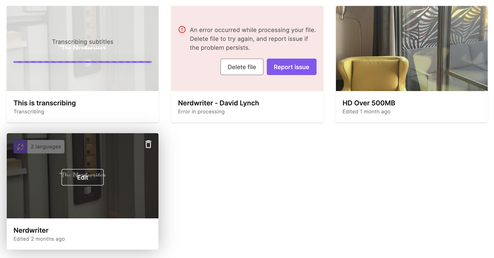

# Subly Frontend Test
The goal of this exercise is to build a simple dashboard for Subly, where a user can see all the videos she has on her account.

This test shouldn't take you more than 4 hours to complete. You should build React components using Typescript to render cards (see image below).

You have full freedom for any package you want to use and you can use any CSS framework of your choice ([Bootstrap](https://getbootstrap.com/), [Tailwind](https://tailwindcss.com/), [Bulma](https://bulma.io/), etc) if it helps you with the styles.

It would be nice if you make some commits along the way and push your changes in the end.

The final result should look something like this:

## Getting Started

First, install all dependencies:

```bash
npm install
# or
yarn
```

And then run the development server:

```bash
npm run dev
# or
yarn dev
```

Open [http://localhost:3000](http://localhost:3000) with your browser to see the result.

You can start editing the page by modifying `pages/index.tsx`. The page auto-updates as you edit the file.

There is an [API route](https://nextjs.org/docs/api-routes/introduction) set for you already on [http://localhost:3000/api/media](http://localhost:3000/api/media). This endpoint returns the list of media that you have to render for your exercise, you can investigate it but you shouldn't need to touch it.

---

## What do you have to build?

This is what we expect from you:
1. Fetch all media from the endpoint
2. Render each `Medium` into a card
    1. Cover image
    2. Title
    3. Status / Last edited
3. The card can render the many possible states of a `Medium` and have sligtly different renders:
    1. `MediumStatus.Ready`: On hover state should show an edit button on top of the cover image, and show how many languages the `Medium` has
    2. `MediumStatus.Error`: Show an error message instead of the cover image
    3. `MediumStatus.Transcribing`: Show a loading bar on top of the cover image

### Bonus points for a cookie 🍪
1. Add some filters on top, based on the `MediumStatus` and the languages (eg. show only media in english)
2. Create some tests for your components
3. Deploy the result to [vercel.com](https://vercel.com) 🚀

